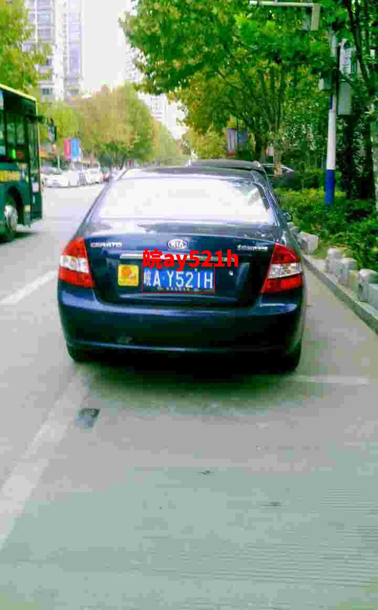
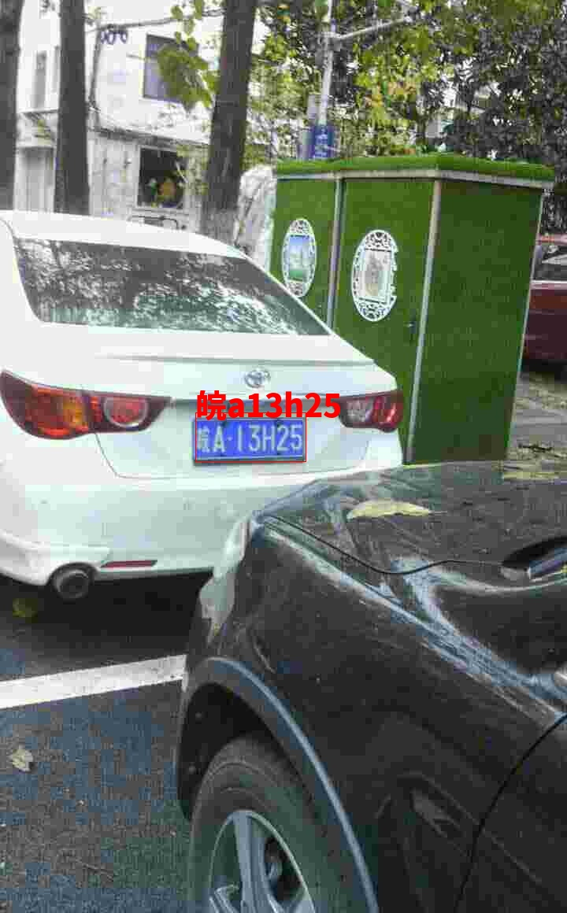

# 端到端中文车牌识别

这是一个[pytorch](http://pytorch.org/)实现的端到端中文车牌识别，整个项目主要是从[SSD](https://github.com/amdegroot/ssd.pytorch)修改而来的，非常感谢作者的开源。同时项目主要参考了阿里的这篇paper[A Novel Integrated Framework for Learning both Text Detection and Recognition](https://arxiv.org/abs/1811.08611v1)的思想，实现了ocr_roi_pooling，基于此，可以将检测、分类和文字识别整合在一个网络任务中进行训练，并采用vgg做为特征提取网络。端到端OCR的优势主要有：
1. 速度更快，因为采用同一个特征提取网络
2. 识别部分的视野相对于CRNN的方法会更大
3. 就是步骤少了，最起码我们只用处理一遍数据了，所以人类的懒惰才是推动科技进步的源动力。

现在网上也有相关开源的中文车牌识别项目。但大多都是采用SSD做车牌检测，CRNN做车牌识别。最起码训练和推导是采用两步走的策略。

### 数据集
我采用了[CCPD: Chinese City Parking Dataset](https://github.com/detectRecog/CCPD)数据集，但是GPU计算能力有限，于是随机选择了70000张作为训练样本，采用batchsize=16,迭代了30000次。你可以下载整个数据集，然后将测试样本图片放到`./data/test_data`。

如果你要用你自己的图片进行测试，要看ssd300是否能检测出来(检测部分是SSD300)。


## 依赖安装
1. 克隆项目
```python
git clone https://github.com/chenjun2hao/CLPR.pytorch.git
```

2. 安装cupy，实现ocr_roi_pooling的时候，使用cupy进行了GPU加速。**注意：** 最开始的时候也用numpy实现了ocr_roi_pooling的功能，但是训练的时候速度太慢了。训练了一天还没有收敛。所以深度学习GPU加速那是必须的，特别是训练的时候。cupy的具体安装可以参考[cupy](https://github.com/cupy/cupy)，例如：
```bash
(Binary Package for CUDA 9.0)
$ pip install cupy-cuda90
```

3. 其他
```bash
python 3.6
pytorch 0.4.0
```

## 测试
- 下载预训练的模型[Baidu disk](https://pan.baidu.com/s/1kxbXWjfOwoLgn1qaCSRQnw), password:16pk，然后将模型放到`weights`文件夹下

```python
python test.py
```
some examples:
<table>
    <tr>
        <td ><center>图1 </center></td>
        <td ><center>图2 </center></td>
    </tr>
    <tr>
        <td ><center>图3 </center></td>
        <td ><center>图4 </center></td>
    </tr>
    <tr>
        <td ><center>图5 </center></td>
        <td ><center>图6 </center></td>
    </tr>
</table>


## 训练
**Coming later**  整理好了再开源

## TO DO
- [] 对于斜视或者倾斜车牌的效果不好。可以在识别网络中加入一个矫正网络。
- [] 识别部分很容易将最后一位漏掉，或者多字的情况。可以尝试多尺度的特征融合，再在channel上加上SEmodule，增加识别部分的特征。


## References
- [CCPD: Chinese City Parking Dataset](https://github.com/detectRecog/CCPD)
- [Chainer](https://github.com/Hakuyume/chainer-ssd)
- [ssd.pytorch](https://github.com/amdegroot/ssd.pytorch)
- [chenjun2hao/CLPR.pytorch](https://github.com/chenjun2hao/CLPR.pytorch)
