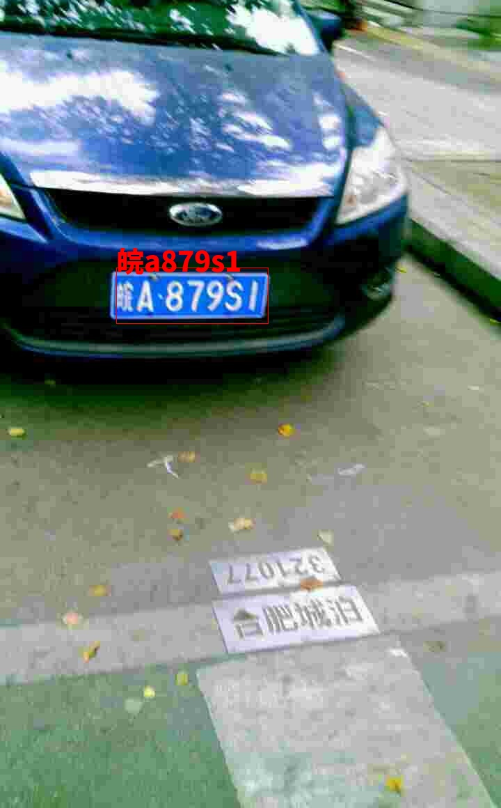

# CLPR:End to End Chinese License Plate Recognition
A [PyTorch](http://pytorch.org/) implementation of End to End Chinese License Plate Recognition, the whole project is mainly modified from [SSD](https://github.com/amdegroot/ssd.pytorch), which is a Single-stage object detector. And I mainly adopted the idea of this article([A Novel Integrated Framework for Learning both Text Detection and Recognition](https://arxiv.org/abs/1811.08611v1)) and designed an OCR ROI pooling operation, so that detection, classification and text recognition can be integrated into one net for training, and using VGG as the backbone network.

### Dataset
And i use [CCPD: Chinese City Parking Dataset](https://github.com/detectRecog/CCPD) for training, i random choose 70000 sample for training. You can download the whole dataset or just use the images in `./data/test_data`


## Installation requirement
1. install [cupy](https://github.com/cupy/cupy), for example:
```bash
(Binary Package for CUDA 9.0)
$ pip install cupy-cuda90
```

2. Other dependencies
```bash
python 3.6
pytorch 0.4.0
```

## Test
For testing, download the pretrained model from [Baidu disk](https://pan.baidu.com/s/1kxbXWjfOwoLgn1qaCSRQnw), password:16pk, and put the model in weights folder.
```
python test.py
```
here are some examples:  
 | 
 | 


## Train

**Coming later**  

## TO DO
- [] For strabismus license plate recognition effect is not good, can add amendments
- [] Character recognition is easy to leak out, and it combines multi-layer features for character recognition.


## References
- [CCPD: Chinese City Parking Dataset](https://github.com/detectRecog/CCPD)
- [Chainer](https://github.com/Hakuyume/chainer-ssd)
- [ssd.pytorch](https://github.com/amdegroot/ssd.pytorch)
